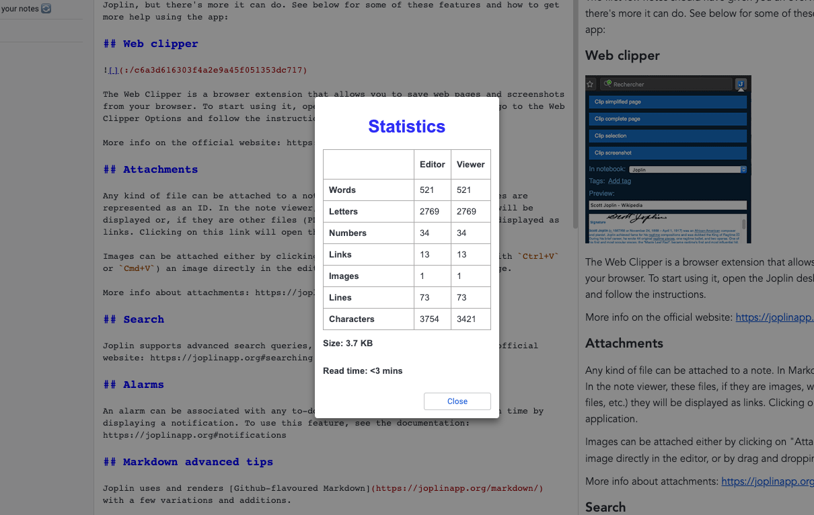

# Joplin Note Statistics

Note Statistics is a plugin to extend the functionalility of [Joplin's](https://joplinapp.org/) inbuilt note statictics.

It allows to get statistics on number of words, images, links and more for any selected note, in a extra dialog view, which can be accessed from the toolbar

## Table of contents

- [Features](#features)
  - [Screenshots](#screenshots)
- [Installation](#installation)
- [Usage](#usage)
- [Building the plugin](#building)
- [License](#license)

## Features

- It shows statistics on the number of:
  - Characters
  - Words
  - Numbers
  - Lines
  - Links
  - Images
  - Read time
  - Note Size
  - Code fences
    - Not yet supported right now
- Click on icon on toolbar to acces dialog view

### Screenshots

#### Dialog

## Installation

### Automatic (Joplin v1.6.4 and newer)

- Open Joplin and navigate to `Tools > Options > Plugins`
- Search for `Note Statistics` and press install
- Restart Joplin to enable the plugin
- By default the icon will appear on your tool bar

### Manual

- Download the latest released JPL package (`*.jpl`) from [here](https://github.com/Kaid00/joplin-note-statistics/releases/tag/1.0.0)
- Open Joplin and navigate to `Tools > Options > Plugins`
- Press `Install plugin` and select the previously downloaded `jpl` file
- Confirm selection
- Restart Joplin to enable the plugin

### Uninstall

- Open Joplin and navigate to `Tools > Options > Plugins`
- Search for the `Note Statistics` plugin
- Press `Delete` to remove the plugin completely
  - Alternatively you can also disable the plugin by clicking on the toggle button
- Restart Joplin

## Usage

### From the tool bar

Click on the ℹ️  icon to view the note statistics

### Building the plugin

If you want to build the plugin by your own simply run `npm run dist`.

### Updating the plugin framework

To update the plugin framework, run `npm run update`.

## License

Copyright (c) 2021 Azamah Junior

MIT License. See [LICENSE](./LICENSE) for more information.
